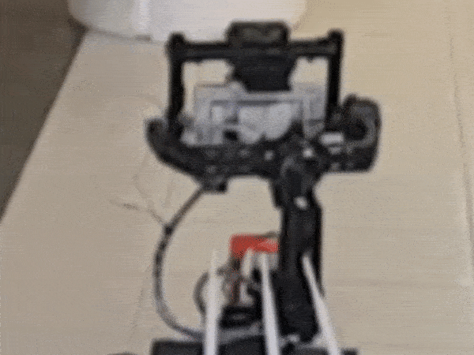

DJI Ronin - ROS Control Unit
------------------------

### OVERVIEW ###
This is probably the worst way to control the DJI Ronin gimbal, but hey! it works great and **nowadays that's the only way to control it**.

### WHY? HOW? ###
DJI Ronin, 3 Axis gimbal, DJI decided to release their device without any API for developers, which makes it absolutely useless.  
__The Easy Way__ - Just buy gimbal which is based on Basecam/Alexmos, they DO have Serial API. 
__The Hard Way__ - Creating a server which runs the DJI Ronin app on android and continuously transmits screen capture of the app to a server on the robot through ADB(using sji), using KNN to recognize the digits from the screen capture and publish Pan, Tilt, Roll as custom ROS message.  
The control node will subscribe to the angles and rotate the gimbal using an Arduino board(will explained below) to a given angle using the rosservice call. 
In my case, The gimbal is mounted on the front of robot aiming the sensing unit at different directions, i already had the ronin so instead of buying a new gimbal i looked for a 'creative' way to control it.

### Hardware ###
* Arduino Uno
* MCP41050
link:  https://www.aliexpress.com/item/Free-shipping-5pcs-lot-MCP41050-MCP41050-I-SN-Main-new-original/32590069086.html?spm=2114.13010608.0.0.T8xddP

* Android Cellphone - Runs DJI Ronin Assistant
link:  https://play.google.com/store/apps/details?id=com.dji.gimbal

* Micro USB Cable
* DJI Remote

### Circuit Diagram ###
Thanks to Learning about Electronics   

 
Instead of LED at the diagram you should connect one of the axis from the DJI remote pan/tilt/roll potentiometer. 
After creating the circuit you should calibrate the poteniometer to the DJI remote using USB cable and windows application, this will give you the settings to speed var at the DJIRonin_Control.py

### Installation ###
The package will do most of the things for you, download DJI Ronin App to your android mobile, connect it through usb. 
Running the launch file will open the app on your mobile, just press 'MOTORS'. 
The phone capturing resolution will set to 360x640, the script will locate your phone capturing address(SJI) automatically.

### Software ###
* ROS
* OpenCV
* SJI Android Capture Server
* NodeJS
* ADB
* Python Dependencies: Naked, pySerial, numpy, PIL, matplotlib. (use *pip install*)

### Calibration###
In order to rotate the gimbal CCW/CW, we need to calibrate our custom remote to fit the MCP41050 pot, using DJI ronin app set the Arduino to a value that fits your RC scale, set this values as default.  
In order to find the values that rotates the gimbal open a serial communication with the Arduino board (via Putty or so) at baud 9600, and enter 1 SPEED, and 2 SPEED, 1/2 refers to CW, CCW.  Write this values in the speed variable in DJIRonin_Control.py.

### Examples ###

 Image processing using OpenCV 

 DJI Ronin controlled by dji_ronin node 

 Arduino RC Circuit

### ROS Interface ###
* Publisher - /GimbalAngle  
msg - Pan,Tilt,Roll
* TF update from ronin_base_link to base_link based on yaw angle
* launch file -  
Publish_Digits - 1/0 will publish an opencv image to */DJI_Ronin_App_Digits* 
Publish_App - 1/0 will publish SJI capture to */DJI_Ronin_App* 
* Service - /DJI_RotateTo dir ang 
For Example - in order to rotate to -20 will write rosservice call /DJI_RotateTo 2 20

### Known Issues ###
* Add timeout to rotation service

### About ###
Itamar Eliakim 
M.Sc Student Mechanical Engineering Faculty at Tel Aviv University, Israel 
Email - Itamare@gmail.com

